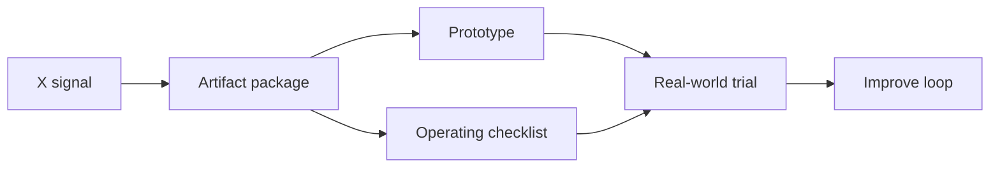

# Self-Healing Agent Observability Kit Infographic

## Core idea
Production agents need a failure cockpit before teams can trust autonomous fixes: traces, issue detectors, routing, replay, and repair decisions.

## Before / after
- Before: scattered tweet saved as passive inspiration.
- After: GitHub-visible artifact with a prototype, loop, and next test.

## How Vinay can use it
1. Open the prototype.
2. Fill the workflow-specific fields.
3. Copy the generated handoff into a repo issue, agent task, or product brief.
